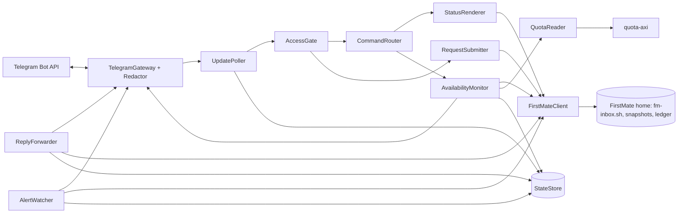

# firstmate-telegram: v1 specification

Status: specification. No code exists yet; v1 is built against this document.
Every FirstMate fact below was checked against FirstMate `main` at commit [`e9a6675`][fm-commit] (2026-09-26).
Words with a fixed meaning here (bridge, request, reply, alert, status answer, availability, ping, away mode, private project, explicit return) are defined in [CONTEXT.md](../CONTEXT.md).

## Contents

1. [Overview](#1-overview)
2. [Goals and non-goals](#2-goals-and-non-goals)
3. [Vocabulary](#3-vocabulary)
4. [User-facing behaviour](#4-user-facing-behaviour)
5. [Authority and security model](#5-authority-and-security-model)
6. [Privacy and the deny list](#6-privacy-and-the-deny-list)
7. [FirstMate integration contract](#7-firstmate-integration-contract)
8. [Reliability](#8-reliability)
9. [Bridge state and files](#9-bridge-state-and-files)
10. [Configuration and setup](#10-configuration-and-setup)
11. [Runtime and install](#11-runtime-and-install)
12. [Architecture](#12-architecture)
13. [Testing strategy](#13-testing-strategy)
14. [Upstream dependencies and later proposals](#14-upstream-dependencies-and-later-proposals)
15. [v2 and later](#15-v2-and-later)
16. [Open questions](#16-open-questions)

## 1. Overview

firstmate-telegram lets a [FirstMate][fm] user talk to their FirstMate from a private Telegram chat with their own bot.
It is a small standalone .NET program that runs on the same Mac as FirstMate, as a login agent, and does two jobs:

- **Chat.** The user sends a request from the phone. The bridge saves it in FirstMate's inbox, FirstMate answers through the inbox, and the bridge sends the reply back, threaded to the request.
- **Alerts.** When something needs the user, such as a PR ready for review, a decision, or a real failure or blocker, the bridge sends an alert built from FirstMate's records.

Two commands are answered without involving FirstMate at all:

- `/status` gives an instant status answer read from FirstMate's saved records.
- `/ping` gives an availability check, and the bridge always answers it itself.

The bridge only pulls from Telegram, by long polling over outbound HTTPS. There is no server, no open port and no hosting cost. It works only while the Mac is awake and online.

It talks to FirstMate only through FirstMate's inbox command, its read-only snapshot commands and its fleet activity ledger. It needs no FirstMate code change, and it works whichever agent tool runs FirstMate (Claude Code, Pi, Codex or another).
One bot serves one FirstMate setup.

Related work: FirstMate has an open, unmerged pull request that adds a bash Telegram bridge inside FirstMate's core ([kunchenguid/firstmate#4364][pr-4364]).
This project is a separate companion instead, so it can ship and change on its own schedule.

## 2. Goals and non-goals

Goals for v1:

1. Send requests from the phone and get FirstMate's replies, with no request lost or duplicated.
2. Receive alerts only for what FirstMate would interrupt the user for.
3. Get an instant status answer and an honest availability answer, even when FirstMate is stopped.
4. Keep the phone's authority below the terminal's: ask questions and start or steer work, nothing irreversible.
5. Install on a Mac with one script from a clone, and keep running across logins and crashes.

Non-goals for v1:

- WhatsApp. Meta's business API has barred general-purpose AI assistants since 2026-01-15, and the unofficial libraries break WhatsApp's terms.
- Voice notes, photos, files, or any other non-text message.
- Tap buttons for decisions; decisions are answered by replying in text.
- Approving merges, deletions, or any irreversible or security-sensitive action from the phone.
- A hosted service, a webhook, or an outside watchdog.
- Linux or Windows. The service-install part is kept separate so Linux is a small later addition.
- Changing FirstMate. Anything that needs a FirstMate change is an upstream dependency (section 14), and v1 works without it.
- Claude Code's built-in Telegram "Channels" plugin. It only works when FirstMate runs on Claude Code, keeps no durable queue, and gives the phone the same authority as the keyboard.
- Several FirstMate homes, or several users, per bot.

## 3. Vocabulary

[CONTEXT.md](../CONTEXT.md) is the glossary. Two reminders:

- The bridge is never called a relay. Relay is FirstMate's name for its hosted Discord and X integration.
- FirstMate calls its human user "the captain". This spec says "the user", and uses "captain" only inside FirstMate's own names, such as Captain's Call or a captain hold.

## 4. User-facing behaviour

### 4.1 Requests and replies

Any text message from the user that is not one of the commands in 4.3 is a request.

1. The bridge saves the request in FirstMate's inbox (7.2.1).
2. As soon as the inbox has saved it, the bridge reacts to the user's message with 👀. The reaction means "FirstMate has it", whether or not FirstMate is running.
3. If FirstMate is not running, or is running but not picking up requests, the bridge also replies once, for example: "FirstMate isn't running right now. Your request is saved and it will see it when it starts." The wording follows the `/ping` verdict (4.3.2).
4. When FirstMate publishes its reply, the bridge sends it as a reply to the user's message and replaces 👀 with the "replied" reaction. The decided reaction is a check mark; Telegram does not allow ✅ as a bot reaction, so 👌 stands in for it by default (`replied_reaction` in 10.1 makes it configurable).
5. A reply too long for one Telegram message (4096 characters) is split into numbered parts, `(1/3)`, `(2/3)`, `(3/3)`, each threaded to the user's message and split at paragraph or line boundaries where possible.

Details:

- Text only. A photo, voice note, sticker or file gets "Only text messages are supported for now.", and nothing is sent to FirstMate.
- Editing a message after sending does not change the request; send a new message instead. The bridge does not subscribe to edits.
- Replies are sent as plain text with link previews off. FirstMate's text is shown exactly, and Telegram's servers do not fetch the links.
- A request that FirstMate handles without writing a reply keeps only 👀.
- Requests reach FirstMate's inbox in the order they were sent.
- A request never ends away mode (4.3.6). During away mode FirstMate acts on requests under the user's away instructions, as it does for any inbox note.

### 4.2 Replying to an alert

Using Telegram's reply on an alert sends FirstMate a request tied to that alert.
The request carries the alert's text, so FirstMate knows which PR, decision or task the user means.
This is how decisions are answered in v1 ("go with option B").
The authority limit in section 5 still applies: a design pick works, a merge approval does not.

### 4.3 Commands

| Command | Answered by | What it does |
| --- | --- | --- |
| `/status` | the bridge, from records | Four-part status answer: instant, no tokens spent |
| `/ping` | the bridge | Instant availability check with a one-line verdict |
| `/ping live` | the bridge, after a round trip through FirstMate | Availability check that FirstMate itself must answer within a timeout |
| `/mute <duration>` | the bridge | Deliver alerts silently for a while |
| `/unmute` | the bridge | End a mute |
| `/back` | the bridge, then FirstMate | Explicit return: end away mode |
| `/stop` | the bridge | Stop the bridge until it is started again on the Mac |
| `/help` | the bridge | List the commands |

Anything else, including an unknown `/word`, is a request.
Commands are matched case-insensitively, and Telegram's `/command@BotName` form is accepted.
The bridge registers this command list with Telegram for the user's chat only, so Telegram's command menu shows it there and nowhere else.

#### 4.3.1 `/status`

The status answer is built from FirstMate's saved records without interrupting FirstMate or spending model tokens, and arrives within a few seconds.
It shows the same four parts as a FirstMate bearings report, one line per item, in this order:

1. **Needs you** (FirstMate's Captain's Call): decisions waiting on the user, PRs ready for review with their links, and finished research.
2. **Recently landed**: recently finished work, with its PR link when there is one.
3. **Under way**: work in progress, with its current state.
4. **Next**: queued or waiting work, with what it waits on.

Example:

```text
FirstMate status, 14:05 (away mode on)
Needs you (2)
• Decide: billing API versioning. Options: A path prefix, B header
• Review: fix login redirect https://github.com/acme/webapp/pull/7
Recently landed (1)
• docs refresh https://github.com/acme/webapp/pull/5
Under way (1)
• webapp: add CSV export (working, tests passing)
Next (1)
• release notes (waits on: add CSV export)
```

- Each part shows at most 8 items and then "+N more". An empty part says "nothing".
- The header says when away mode or quiet mode is on.
- Private projects appear as "a private project", with no title or link (section 6).
- If the records cannot be read, the answer says so in one line with the reason, for example "Could not read FirstMate's records: the snapshot timed out". It is never silence.
- 7.2.5 gives the source of each part, including the fallback used while away mode is on.

#### 4.3.2 `/ping`

The bridge answers every ping itself within a few seconds, even when FirstMate is stopped or its records cannot be read.
The first line is a one-line verdict. The lines below it show the checks behind the verdict.

```text
Running, but Claude quota is out until 21:40
FirstMate: running, listening
Away mode: on
Claude quota: 0% left, resets 21:40
Bridge: up 3 days
```

The verdict is the first row that applies:

| Verdict | When |
| --- | --- |
| `Not running; requests will queue` | FirstMate's session lock is free or stale |
| `Running, but not picking up requests; requests will queue` | The session is held, but FirstMate's wake monitoring is down |
| `Unknown: could not confirm FirstMate is running` | The session state cannot be read, or the check failed or timed out |
| `Running, but Claude quota is out until <time>` | Quota is readable and exhausted (`until reset time unknown` when no reset time is known) |
| `Running, but not responding: a request has waited <n> min` | The oldest unacknowledged inbox note has waited longer than `unresponsive_after` (15 minutes by default) |
| `Probably ready; listening could not be confirmed` | The session is held, but FirstMate reports its listening state as unknown |
| `Ready` | None of the above |

- The away mode line reads `on`, `off`, `quiet mode` or `unknown`. Quiet mode is FirstMate's present-but-quiet posture, which is not away mode.
- The quota line reads `unknown` when quota cannot be read (7.5.3). The verdict then ignores quota.
- 7.5 defines each check.

#### 4.3.3 `/ping live`

1. The bridge runs the instant checks first. If they already say FirstMate is not running or not picking up requests, it answers with that verdict and adds: "No live check was sent, so FirstMate won't answer a stale ping later."
2. Otherwise it saves a short availability-check request in FirstMate's inbox. The request asks FirstMate to reply with one short line and take no other action. The bridge says "Asking FirstMate directly (up to 60 s)." and waits for the reply.
3. If the reply arrives within the timeout (`live_ping_timeout`, 60 seconds by default), the bridge says "Live: FirstMate answered in 14 s."
4. If it does not, the bridge says "Not available: FirstMate did not answer within 60 s.", followed by the instant check lines. While away mode or quiet mode is on, it adds: "In away mode, FirstMate can take a couple of minutes to pick up a request." See open question 2.
5. A reply that arrives after the timeout is still sent, marked as late: "FirstMate answered the live ping after 4 min."

A live ping is a real FirstMate turn and uses a small amount of model quota. `/ping` does not.

#### 4.3.4 `/mute <duration>` and `/unmute`

- Durations look like `30m`, `2h`, `1d`, or combinations such as `1h30m`. Plain `/mute` means one hour. The maximum is 7 days.
- While muted, alerts are still sent, but as Telegram silent messages, with no sound or vibration. Nothing is lost, and `/status` still shows everything.
- Replies to the user's own requests are never muted.
- `/mute` answers "Alerts are silent until 16:30." `/unmute` answers "Alerts are back on." A mute also ends on its own at its end time.
- A mute survives bridge restarts.

#### 4.3.5 `/help`

`/help` lists the commands, one line each, and ends with "Anything else is sent to FirstMate as a request."

#### 4.3.6 `/back`

`/back` is the only way to end away mode from Telegram.
Plain words such as "I'm back" never end it, and the request footer tells FirstMate the user is still away (7.2.1).

| Situation | What `/back` does |
| --- | --- |
| Away mode is off | Answers "Away mode is not on." |
| Quiet mode is on | Answers "FirstMate is in quiet mode, not away mode. Quiet mode ends only at the terminal." |
| Away mode is on, and FirstMate has the explicit-return hook | Saves an explicit-return record in FirstMate's inbox and reacts 👀. FirstMate runs its normal return and replies with a short return summary, which the bridge sends back. If FirstMate is not running, the return waits in the inbox like any request, and the bridge says so. |
| Away mode is on, and FirstMate lacks the hook | Answers "Away mode is still on. Ending it from Telegram needs a newer FirstMate; end it at the terminal for now." Nothing is sent to FirstMate. |

Today's FirstMate cannot end away mode from an inbox note.
So v1 ships `/back` in its "needs a newer FirstMate" form, and switches to the working form on its own once FirstMate gains the hook.
7.4 gives the evidence and specifies the hook.

#### 4.3.7 `/stop`

`/stop` is the phone-side kill switch, matching the local `firstmate-telegram stop` command.

- The bridge answers "Bridge stopped. Start it again on the Mac with `firstmate-telegram start`." It then confirms the `/stop` message to Telegram so it is not delivered again, records a stopped flag in its own state, and exits.
- While the flag is set, the bridge stays stopped across restarts, logins and reboots. It does not poll Telegram or send alerts.
- Only `firstmate-telegram start` on the Mac clears the flag. Someone holding the phone can stop the bridge but cannot start it again.
- `/stop` does not touch FirstMate.

See open question 3.

### 4.4 Alerts

An alert carries only what FirstMate would interrupt the user for.
Routine progress, retries and automatic fixes never alert.

| Kind | Example text | Source (section 7) |
| --- | --- | --- |
| PR ready for review | `Ready for your review: fix login redirect https://github.com/acme/webapp/pull/7` | Ledger `task.pr_ready` |
| Research finished | `Research finished: search provider options. Reply to this message to get the findings.` | Ledger `task.status` with state `done`, for a scout task |
| Decision to make | `Decision needed: billing API versioning. Options: A path prefix, B header. Reply to this message with your answer.` | A new live captain hold in the fleet snapshot |
| Worker waiting on a decision | `Waiting on a decision: add CSV export. <status text>` | Ledger `task.status` with state `needs-decision`, still open after the settle window |
| Blocker | `Blocked: add CSV export. <status text>` | Ledger `task.status` with state `blocked`, still open after the settle window |
| Failure | `Failed: add CSV export. <status text>` | Ledger `task.status` with state `failed`, still open after the settle window |
| Availability | `FirstMate stopped while you are away. Requests will queue until it starts.` | `ready` and quota checks, only in away mode (4.4.1) |

Rules:

- **One alert per event.** Each alert has a dedupe key (7.2.6), and the bridge never sends the same key twice.
- **Alerts always fire**, whether or not the user is at the terminal. `/mute` makes them silent; it never drops them.
- **A needed credential or login** has no structured record in FirstMate today. It reaches the user as a decision or blocker alert when FirstMate records it as one. A separate alert kind needs the captain outbox (section 14).
- **Settle window.** A worker's `needs-decision`, `blocked` or `failed` status goes to FirstMate first, and FirstMate often resolves it without the user. These three kinds alert only if the same task and decision are still open after `alert_settle` (15 minutes by default). They never alert when the same task already has a decision alert from a captain hold. See open question 4.
- **Wording** comes from FirstMate's records: task titles, captain-hold reasons and worker status text. FirstMate's own escalation wording is not available to outside tools yet; the captain outbox proposal (section 14) would provide it.
- **No history.** On first start, the bridge takes the current records as its starting point and does not alert on anything before it.
- Alerts are plain text, with link previews off and the deny list applied.
- An alert never asks the user to approve a merge from the phone. A PR alert says the PR is ready for review; merging still needs the terminal (section 5).

#### 4.4.1 Availability alerts

Availability alerts fire only while FirstMate is truly in away mode: its posture reads `away`, and quiet mode does not count.
Outside away mode, availability is on demand through `/ping`.

| Alert | Fires when the verdict (debounced, 7.5.4) becomes |
| --- | --- |
| `FirstMate stopped while you are away. Requests will queue until it starts.` | Not running |
| `FirstMate is running but not picking up requests.` | Running, but not picking up requests |
| `FirstMate has not picked up a request for 15 min.` | Running, but not responding |
| `Claude quota is out until 21:40. FirstMate can't work until then.` | Running, but quota is out |
| `FirstMate is available again (was stopped for 42 min).` | Ready again, after one of the above was alerted |

The bridge sends an "available again" alert only for an outage it alerted.

### 4.5 When the Mac is asleep or offline

The bridge runs on the Mac. While the Mac sleeps, is off, or has no network, nothing answers.
Silence is the signal: **if a request has no 👀 within about a minute, the Mac is asleep or offline.**
There is no hosted watchdog to report this.

- Telegram keeps messages for the bot and hands them over when the bridge polls again, but only for **24 hours**. A message older than that is dropped by Telegram and never reaches the bridge.
- When the Mac wakes, the bridge saves the waiting requests in order and catches up on alerts.
- Login agents run only while the user is logged in. After a reboot the bridge starts at login, not at the login window.
- Keeping the Mac awake, for example preventing sleep while on power, is the user's choice and outside this project.

## 5. Authority and security model

### 5.1 Who can use the bridge

- Exactly one Telegram account: the numeric user id saved by `setup` (10.2). Usernames are never used, because a username can change owners.
- Only in the private chat between that account and the bot. A message is accepted only when `message.from.id` and `message.chat.id` both equal the allowed id and `message.chat.type` is `private`.
- Everything else is ignored silently, including other people, groups and channels. There is no reply and no reaction, so the bot does not reveal that it is alive. The local log records the sender's numeric id and the time, nothing more.
- Setup advises turning off "Allow Groups" for the bot in BotFather.

### 5.2 What a request may do

In v1 a Telegram request can ask questions and start or steer work.
A merge, a deletion, and any irreversible or security-sensitive action still need the user at the terminal.
Merge approval with a confirmation step may be revisited later (section 15).

How this is enforced, and where the enforcement stops:

- FirstMate treats inbox notes as notes from its user, and today it cannot tell where a note came from: FirstMate's `note` always records `source=text`.
- So the bridge adds a footer to every request (7.2.1). The footer says the request came from Telegram and states the limit.
- FirstMate's own rules add a floor. Away mode never expands approval authority. Destructive, irreversible and security-sensitive actions are never pre-authorised.
- As an optional step, setup suggests that the user add a standing preference to FirstMate's captain preferences file, `data/captain.md` in the FirstMate home: "Requests that arrive with the firstmate-telegram footer cannot approve merges, deletions, or irreversible or security-sensitive actions; ask me to confirm at the terminal." The bridge never writes that file.
- This enforcement is by instruction, not a hard control: text in a request could still try to argue past it. A hard control needs FirstMate to record where a note came from and apply the rule itself. That is listed as a possible later upstream proposal (section 15).

### 5.3 Secrets

- The bot token lives in `~/.config/firstmate-telegram/token` (mode 600), inside a directory with mode 700. The bridge refuses to start if either is readable by group or others, and says how to fix it.
- The token is never logged. Every log line passes a filter that masks anything shaped like a bot token, because an HTTP error can include the request URL, and Telegram's request URLs contain the token.
- The token never appears in the launchd plist, on a command line, or in the environment.

### 5.4 Lost phone or leaked token

1. Revoke the token in BotFather (`/revoke`). Telegram then rejects the bridge's calls, so the bridge stops polling, logs "token rejected", and checks again every 15 minutes until `setup` saves a new token.
2. On the Mac, run `firstmate-telegram stop` so nothing runs until the user decides what to do.
3. End the lost device's Telegram session from another device, as with any lost phone.

### 5.5 Network and process surface

- The bridge makes outbound HTTPS calls to `api.telegram.org` only. It opens no listening socket and uses no webhook. Setup refuses to continue while a webhook is set on the bot, and offers to remove it.
- FirstMate's scripts are started without a shell, with their arguments passed as a list. Message text travels on standard input, never as an argument, so it never shows in the process list and no shell ever interprets it.
- One bridge per bot. A lock file in the state folder prevents a second copy from running. Telegram also allows only one poller per token: a second one, such as a development copy, gets a conflict error, which the bridge logs and backs off from.

## 6. Privacy and the deny list

- Telegram bot chats are not end-to-end encrypted; Telegram's servers can read them. Full detail (titles, PR links, FirstMate's replies) may leave the Mac this way, and that is the accepted trade-off.
- The **deny list** (`deny_list` in the configuration) names projects that must never be named on Telegram. It ships **empty**.
- A structured row whose project or repository matches a deny-list entry, such as a status line or an alert, is shown as "a private project", with no title, status text or link. A PR alert for a private project reads "A PR in a private project is ready for your review."
- Free text, such as FirstMate's replies and worker status text, is filtered on a best-effort basis. Each entry, and any GitHub URL whose repository name matches an entry, is replaced with "a private project", case-insensitively and on whole words. Text that describes the work without naming the project can still reveal it.
- Matching uses FirstMate's project directory name (the ledger's `project` member) and the task's repository.
- The deny list applies to everything the bridge sends, including replies to requests.
- The local log keeps times and ids only: Telegram update and message ids, inbox note ids, and alert keys. It never keeps message text, and it records strangers by numeric id only.

## 7. FirstMate integration contract

### 7.1 Requirements

- FirstMate `main` at or after [`e9a6675`][fm-commit] (2026-09-26). The inbox surface arrived in [#5103][pr-5103], and the ledger with `task.pr_ready` events in [#5375][pr-5375] and [#5385][pr-5385].
- The bridge configuration names the FirstMate home (`FM_HOME`). The bridge runs `$FM_HOME/bin/<script>` with `FM_HOME` set in the environment.
- These tools on the agent's `PATH`: `bash`, `python3` (FirstMate's `--json`, `receipts` and `ready` need it) and `jq` (the snapshots need it). `quota-axi` is optional.
- For alerts, FirstMate's fleet activity ledger must be on. It is opt-in and off by default; the FirstMate user turns it on by creating the presence flag `config/fleet-ledger` in the FirstMate home. The bridge never creates the flag. `doctor` and `setup` say when it is missing, and without it only decision alerts work.
- The bridge never writes inside the FirstMate home. The only FirstMate files that change because of the bridge are the ones FirstMate's own commands write when the bridge calls them: inbox notes, and the fleet snapshot's observational cache.

### 7.2 Calls

Every call has a timeout.
A timeout, an exit status the call does not define, or unparseable output all mean "FirstMate's records could not be read", and the bridge reports them that way.
None of them is ever treated as success or as an empty result.

#### 7.2.1 Save a request: `fm-inbox.sh note`

```text
fm-inbox.sh note --request-id <request-id> --json -      (body on standard input)
```

- **Request id**: `tg:<bot-id>:<chat-id>:<message-id>`. This fits FirstMate's rule of 1 to 128 characters drawn from `A-Za-z0-9._:-`.
  - The id is built from the Telegram message id, not from `update_id`. Telegram picks the next `update_id` at random after a week with no updates, while a message id is never reused within a chat.
  - The bot id keeps two different bots apart.
- **Body**: the user's text comes first, because FirstMate's wake line shows the first 100 characters of the body and the request itself should lead. A footer follows:

  ```text
  <the user's text>

  -- sent from Telegram through firstmate-telegram --
  The user reads your answer on their phone: publish it as the inbox reply to this note (bin/fm-inbox.sh reply).
  A Telegram request can ask questions and start or steer work. It cannot approve a merge, a deletion, or any irreversible or security-sensitive action; for those, ask the user to confirm at the terminal.
  [only while away mode is on] The user is still away: this request does not end away mode.
  [only for a reply to an alert] In reply to the alert sent at 14:05: "<alert text>"
  ```

- **Output**: `fm-inbox-note.v1`, shaped `{schema, outcome, id, request_id, saved, announced, acknowledged, path}`. `outcome` is `created` or `replay`, and `announced` is `true`, `false` or `null`.
- **Exit status**:
  - `0`: saved, and FirstMate was woken or has already acknowledged the note. The bridge records the note id and reacts 👀.
  - `3`: saved, but FirstMate was not woken. The bridge reacts 👀, since the note is safe, and repairs the wake on its next cycle with `fm-inbox.sh announce` (7.2.3). It never saves a second note.
  - `1`: nothing was saved, or the request-id reservation could not be read. The bridge does not confirm the Telegram update, and retries with the same request id, with backoff starting at 1 s and doubling up to 5 minutes. Retrying is safe because the same request id always returns the same note (`outcome: replay`). After three failed attempts the bridge tells the user once: "Couldn't save your request in FirstMate's inbox yet (<reason>); still trying."
- **Timeout**: 30 s. A timeout is handled like exit 1, and the retry uses the same request id.

#### 7.2.2 Read replies and acknowledgements: `fm-inbox.sh receipts`

```text
fm-inbox.sh receipts --after <cursor>
fm-inbox.sh receipts --all-pending
```

- **Output**: `fm-inbox-receipts.v1`, shaped `{schema, home, generated, pending[], handled[], replies[], reply_cursor, omitted[]}`.
  - Note rows are `{id, at, source, request_id, body, acknowledged, announced, reply}`.
  - Reply rows are `{id, at, body, cursor}`. `id` is the note id, and `cursor` is a 12-digit, zero-padded sequence number that puts all replies in a strict order.
- `--after <cursor>` returns the replies after that cursor, oldest first, at most 20 at a time. When `omitted[]` reports replies left out by that bound, the bridge calls again straight away from the new `reply_cursor`.
- **For each reply to a bridge note**, the bridge sends the reply, stores the reply's cursor once the last part is sent, and then sets the "replied" reaction best-effort: a failed reaction is logged and skipped, and never blocks the cursor.
- **Replies to other notes**, such as voice, console or terminal tools, only advance the cursor.
- **Cadence**: every 5 s while a bridge request or live ping is waiting for its reply, otherwise every 60 s.
- `--all-pending`, run every 60 s and on `/ping`, finds the oldest unacknowledged note for the "not responding" check (7.5.2).
- **Cursor handling**: the bridge treats the cursor as an opaque string and starts from the empty cursor on first run. Replies from before the bridge's first note belong to no bridge note, so they only advance the cursor.
- **Timeout**: 30 s.
- **Cost over time**: `receipts` reads every note file, so it slows down as FirstMate's handled notes accumulate. That is acceptable for v1.

#### 7.2.3 Repair a missing wake: `fm-inbox.sh announce`

```text
fm-inbox.sh announce --json <note-id>
```

Used only for a note that `note` saved with exit 3.
An `fm-inbox-note.v1` result with outcome `created` or `replay` ends the repair.

#### 7.2.4 Availability and posture: `fm-inbox.sh ready`

```text
fm-inbox.sh ready
```

- **Output**: `fm-primary-ready.v1`, shaped `{schema, home, observed_at, lock{state, pid, live_harness}, wake_consumer{state, reason, beacon_age_seconds}, posture{state}, can_receive}`:

  | Field | Values |
  | --- | --- |
  | `lock.state` | `held`, `free`, `stale`, `unknown`, `unreadable` |
  | `wake_consumer.state` | `healthy`, `down`, `unknown` |
  | `posture.state` | `present`, `away`, `quiet`, `unknown` |
  | `can_receive` | `true`, `false`, `"unknown"` |

- It is read-only: it never takes FirstMate's session lock.
- Used by `/ping`, by the away-mode checks behind `/back` and the request footer, and polled every 60 s for availability alerts.
- **Timeout**: 15 s.

#### 7.2.5 Status answer: `fm-bearings-snapshot.sh --json`, with a fallback

```text
fm-bearings-snapshot.sh --json
fm-fleet-snapshot.sh --json          (fallback)
```

The primary source is the bearings projection (`fm-bearings.v1`). Without `--include-prs` it makes no GitHub calls.

| Part | Fields |
| --- | --- |
| Needs you | Every `decisions_open` row (`summary`), plus each `in_flight` row with state `done` that is either in `recorded_prs` (a PR to review) or of kind `scout` (finished research) |
| Recently landed | `landed` (`what`, `artifact`) |
| Under way | The other `in_flight` rows (`name`, `state`, `doing`, `repo`) |
| Next | `gates` (`title`, `blocked_by`, `reason`), including FirstMate's warning rows |

**Fallback.** `fm-bearings-snapshot.sh` exits 3 while away mode is on: inside FirstMate, the right answer to a bearings request then is to run the return first.
Its check also covers quiet mode on homes where quiet mode runs FirstMate's away daemon.
That is exactly when the phone needs a status answer.
So on exit 3, the bridge reads FirstMate's canonical fleet snapshot instead (`fm-fleet-snapshot.sh --json`, schema `fm-fleet-snapshot.v1`). That snapshot has no away check, takes no lock and sends no wake. The bridge projects the same four parts from it:

| Part | Fields |
| --- | --- |
| Needs you | `backlog.records[]` with `captain_actionable: true` (`title`, `hold_reason`) |
| Recently landed | `backlog.records[]` with `state: "done"`, newest first, at most 6 |
| Under way | `tasks[]` that are not second mates, with `current_state.state`, `backlog.title` and `project`; a finished task shows as done |
| Next | `backlog.records[]` with `state: "queued"` that are not captain-actionable, with `unresolved_blocker_ids` |

- The fallback answer is labelled "(away mode: from FirstMate's fleet records)".
- It is simpler than the bearings projection; for example, it does not merge second mates' landed work into its own.
- Open question 1 asks whether to also propose a read-only away-mode option for the bearings command upstream, so that there is one projection.
- **Timeout**: 60 s for either call. Both may read registered second-mate homes within their own bounded budget, and may refresh FirstMate's cache of those homes' summaries. That refresh is FirstMate's documented behaviour.
- Only exit 3 from the bearings call triggers the fallback. Any other non-zero exit is an error. (An open return catch-up does not make it exit; it shows as a `(return-catchup)` row under Next.)

#### 7.2.6 Alerts: the fleet ledger and the decisions list

**The ledger** is `state/fleet-ledger.jsonl` in the FirstMate home. Its contract is FirstMate's [docs/fleet-ledger.md][fleet-ledger].

- The file is JSON Lines and append-only. Every record has `{v, ts, event, task}`, and the record version is `v: 1`.
- Events used:
  - `task.dispatched` (`kind`, `project`) gives the task's kind and project.
  - `task.pr_ready` (`pr`) gives the PR's full URL.
  - `task.status` (`state`, `key`, `text`) gives a worker status line.
- Readers must ignore members and events they do not know, and the bridge does. Records with any other `v` are skipped and counted in `doctor`.
- **Reading.** Every 15 s the bridge reads new complete lines from its stored byte offset and file identity (device and inode).
  - If the file shrank or was replaced, it reads from the beginning, and the alert history stops repeats.
  - A partial last line is left for the next read.
- **Dedupe keys.** The ledger can repeat records and has no sequence numbers, so keys come from the record's content, not its position:
  - `pr:<task>:<pr-url>`
  - `research:<task>`
  - `status:<task>:<state>:<key, or ts when there is no key>`
- **Trust.** The ledger copies raw worker status text. The bridge gives it the same trust as FirstMate's state folder: it may show the text to the user, and never executes or follows it.

**The decisions list** is `fm-fleet-snapshot.sh --json`, read every 2 minutes and also right after a ledger `needs-decision` record.

- A backlog record with `captain_actionable: true`, meaning a live captain hold, that has not been alerted yet is a new decision.
- Its alert text is the record's `title` and `hold_reason`. FirstMate puts the question and its options in the hold reason.
- The dedupe key is `decision:<task-id>:<first-seen time>`.
- A hold counts as closed after it is absent from two snapshots in a row. If the same task is held again later, that is a new event with a new key.

**Settle-window check.** A `needs-decision`, `blocked` or `failed` status alerts after `alert_settle` only if both of these hold:

- The fleet snapshot still shows that task in the same state, either in its `current_state` or in `hints.open_decisions`. When the status had a key, the match is by key.
- No decision alert exists for the task.

**Kind.** A task is a scout when its `task.dispatched` record says `kind: "scout"`. Without that record, the fleet snapshot's `tasks[]` row decides.

#### 7.2.7 Quota: `quota-axi`

```text
quota-axi --provider <provider> --json --no-credential-refresh
```

- **Optional.** The provider is `claude` unless `quota_provider` in the configuration says otherwise.
- `--no-credential-refresh` keeps the call read-only, so the bridge never renews vendor credentials.
- The bridge never passes `--allow-keychain-prompt`, because a background agent cannot answer a Keychain prompt. Instead, the user authorises Keychain access once in a terminal with `quota-axi --allow-keychain-prompt` and chooses "Always Allow".
- **Output**: a snapshot with `schemaVersion` 5 or 6 (the versions FirstMate accepts) and `providers[]`. From the provider's row, the bridge reads:
  - `state.status` and `quotaSemantics.status`.
  - `quotaSemantics.effectiveAvailability[]`, each entry with `scope`, `status`, `effectivePercentRemaining`, `runway.status` and `limitingWindowIds`.
  - The reset time: `windows[].resetsAt` of the first window listed in `limitingWindowIds` that has one.
- **Reading the result**:
  - The binding scope is the known entry with the lowest `effectivePercentRemaining`.
  - Quota is **out** when that entry's `runway.status` is `exhausted_now` or its remaining percentage is 0.
  - Quota is **unknown** when any of these holds:
    - `quota-axi` is missing, or older than FirstMate's minimum (0.1.51);
    - the call fails, or takes longer than 20 s;
    - the schema is not 5 or 6, or the provider's row is missing;
    - `quotaSemantics.status` is `unknown`, or the row reports an authorisation state such as `keychain_prompt_required`.
- `doctor` says which of these applies, with the one-time command that fixes an authorisation gap.
- **Cadence**: on every `/ping`, and every 5 minutes while away mode is on.

#### 7.2.8 Explicit return (future): `fm-inbox.sh return`

This call does not exist in FirstMate yet; 7.4 specifies it. The bridge calls it only for `/back`:

```text
fm-inbox.sh return --request-id <request-id> --json
```

On today's FirstMate, `fm-inbox.sh return` exits 1 with `unknown subcommand: return` and saves nothing.
The bridge reads exactly that as "the hook is not available".
Every other result is handled like `note` (7.2.1).

### 7.3 Schema versions

- The bridge checks the version of every result: the `schema` member of FirstMate's JSON, the `v` of each ledger record, and quota-axi's `schemaVersion`.
- It accepts only the versions named above:
  - `fm-inbox-note.v1`
  - `fm-inbox-receipts.v1`
  - `fm-primary-ready.v1`
  - `fm-bearings.v1`
  - `fm-fleet-snapshot.v1`
  - ledger `v: 1`
  - quota-axi 5 or 6
- An unknown version is reported in `/status`, `/ping` and `doctor` as "FirstMate's records use a newer format; update firstmate-telegram". The bridge never guesses at an unknown format. Unknown extra members are ignored.
- Captured examples of each schema, tagged with the FirstMate commit they came from, are the test fixtures (section 13).

### 7.4 Ending away mode with `/back` (settled)

**Finding.** Today an inbox note sent during away mode leaves away mode untouched, and a note cannot end away mode without a FirstMate change.

Evidence, from FirstMate at [`e9a6675`][fm-commit]:

- **Away mode is a record, not an inference.** The record is `state/.afk-contract`, owned by [`bin/fm-afk-contract.sh`][afk-contract]. That script says the posture is "never inferred from chat", and that "the captain's first unmarked message archives it".
- **Only an unmarked message returns.** The return trigger is defined in [AGENTS.md section 8][agents-8] and in the [`afk` skill][afk-skill] under "How to exit: the return".
  - Only an unmarked message typed into FirstMate's own conversation ends away mode.
  - A marked message "does not exit that mode". Marked means it carries FirstMate's operational prefix or is a verified operational doorbell.
  - Automatic wakes do not exit it either: Stop-hook feedback, background-task notifications, and hand-backs from the supervision host.
- **An inbox note is never an unmarked message.** `note` saves the record and appends one `check: captain inbox note <id>` wake to FirstMate's wake queue ([`bin/fm-inbox.sh`][fm-inbox]).
  - Where away mode runs FirstMate's away daemon, the daemon classifies every `check` wake as "always escalate" and delivers it in a marked digest. FirstMate processes the note and stays away.
  - On Pi, and on homes that use a supervision host, the supervision branch takes the wake under the away posture. A wake it hands back is "never the captain's return".
- **So a request sent during away mode is acted on under the user's away instructions, and away mode continues.** That matches the decision that a Telegram request never ends away mode.
- **Nothing in FirstMate lets a note end away mode.** The bridge could get there only by running FirstMate's return script itself or by typing into FirstMate's terminal. Both are rejected:
  - *Running `bin/fm-afk-return.sh` from the bridge.* That script is FirstMate's own return path: it stops the away daemon, archives the posture, presents queued wakes, prints the return brief for FirstMate to show the user, and opens a catch-up gate that FirstMate must clear before resuming work. Run from outside, FirstMate would never see the brief or clear the gate, and the bridge would be changing FirstMate's state beyond its inbox.
  - *Typing into FirstMate's terminal.* That depends on the terminal backend, bypasses the durable inbox, collides with FirstMate's composer guards, and breaks the "inbox and records only" rule.

**Choice.** Specify the smallest FirstMate-side hook as upstream dependency U1, and ship v1 without it.
The hook would be proposed upstream only with the user's go-ahead (section 14). It has two parts:

1. **A new subcommand**, `fm-inbox.sh return [--request-id <id>] [--json]`:
   - It records an inbox note of a distinct kind that only this subcommand can write. For example, the note header could carry `source=return`, which the existing `receipts` output already exposes.
   - The note's body is fixed text, so no request text rides along.
   - It appends the same single `check` wake as `note`, so FirstMate's watcher and away daemon need no change.
   - It follows `note`'s request-id, JSON and exit-status contract.
   - It refuses, saving nothing, when no away-mode record exists.
2. **One rule**, in FirstMate's AGENTS.md section 8 away-mode stub and in the `afk` skill's "How to exit" list:
   - An explicit-return note is the user's return, exactly like an unmarked message.
   - FirstMate runs `bin/fm-afk-return.sh`, then publishes a short reply to that note with the return summary, and acknowledges it.

Why this shape:

- **A subcommand, not a new `note` flag.** Today's `note` treats any unknown `--` word as the start of the body, so a flag sent to an older FirstMate would silently save an ordinary note that reads `--return`. An unknown subcommand fails and saves nothing, so the bridge can safely detect whether the hook exists.
- **The marker lives in the note record, not in the body text.** Plain words in a request can therefore never end away mode, whether "I'm back" or a body that is just `/back`.
- **A rule-only variant was rejected.** In that variant, FirstMate would treat a note whose whole body is `/back` as a return, with no script change. The bridge could not tell whether a given FirstMate honours the rule, so `/back` might silently do nothing. Any inbox client that sent that text would also end away mode.
- **No new authority.** Anyone who can run `fm-inbox.sh` as the user can already type at the terminal. Ending away mode never widens FirstMate's approval authority either.

In v1, `/back` checks for the hook on every call (7.2.8) and behaves as described in 4.3.6.

### 7.5 Detecting availability (settled)

Availability has four parts, each read from a documented, read-only source.
Only `/ping live` wakes FirstMate or spends tokens.

#### 7.5.1 Running and listening

These come from `fm-inbox.sh ready` (7.2.4):

| Reading | Meaning |
| --- | --- |
| `lock.state` is `free` or `stale` | Not running |
| `lock.state` is `held` and `wake_consumer.state` is `down` | Running, but not picking up requests. FirstMate's own check already allows a grace period (300 s by default) before it calls its monitoring stale. |
| `lock.state` is `held` and `can_receive` is `true` | Running and listening |
| `lock.state` is `held` and `can_receive` is `"unknown"` | Running; listening unconfirmed |
| `lock.state` is `unknown` or `unreadable`, or the call failed | Unknown |

#### 7.5.2 Stopped responding

Being alive is not the same as responding, so the bridge also uses FirstMate's own inbox acknowledgements.

- FirstMate acknowledges an inbox note once it has handled it.
- The verdict is "not responding" when FirstMate is running and listening but the oldest unacknowledged inbox note is older than `unresponsive_after` (15 minutes by default). This covers notes from any client, found with `receipts --all-pending`, except notes whose announcement is known to have failed.
- This check depends on traffic. With no waiting note there is no evidence either way, and the verdict comes from 7.5.1 alone.
- `/ping live` is the direct test: a round trip through FirstMate that ends in an explicit "not available" when the timeout passes (4.3.3).

#### 7.5.3 Quota

Quota is optional. The bridge reads it through `quota-axi` when that is installed and authorised (7.2.7). Otherwise quota is reported as `unknown` and plays no part in the verdict.
When quota is out, the verdict is "Running, but Claude quota is out until <reset>".

#### 7.5.4 Availability alerts

- The bridge polls `ready` every 60 s and quota every 5 minutes. It acts on the results only while `posture.state` is `away`.
- A bad verdict must hold for two polls in a row, at least 2 minutes, before it alerts. "Available again" likewise needs two Ready polls in a row.
- Nothing alerts during the first 5 minutes after the Mac wakes, because FirstMate's monitoring needs a moment to catch up. The bridge detects a wake when the wall clock jumps by more than twice the poll interval.
- An outage that began before away mode and is still present when away mode starts alerts once, at the first poll in away mode.
- When away mode ends, availability alerts stop, and any not yet sent are dropped.

## 8. Reliability

### 8.1 Requests: exactly once into FirstMate

The bridge runs its own `getUpdates` loop rather than the library's built-in receiver, because the built-in receiver confirms updates on its own schedule.

1. Call `getUpdates` with `offset` one above the last confirmed update, `timeout` 50 s and `allowed_updates` `["message"]`. The HTTP timeout is set above the poll timeout.
2. For each update in order, check the sender (5.1), then run the command or save the request (7.2.1).
3. Save the bridge state, which now includes the note id for the Telegram message.
4. The next `getUpdates` call passes an offset above the handled updates, and that call is what confirms them to Telegram.

| Crash between | On restart | Result |
| --- | --- | --- |
| Receiving an update and running `note` | The update is delivered again, and `note` runs for the first time | One note |
| `note` saving and the bridge saving its state | The update is delivered again; the same request id returns the same note (`replay`) | One note, and the mapping is recovered |
| The bridge saving its state and confirming the offset | The update is delivered again; `note` returns `replay` | One note |
| `note` exiting 3 and the `announce` repair | The repair runs from the saved state | One note, one wake |

- **Only an unbroken run of handled updates is confirmed.** If a request cannot be saved (7.2.1, exit 1), later updates in the same batch are still processed:
  - Commands are answered and remembered by update id.
  - Requests are saved in order behind the blocked one.
  - The offset stays at the blocked update until it saves, and a redelivered command that was already answered is not answered again.
- Reactions and command answers may repeat after a crash. They carry no state for FirstMate.

### 8.2 Replies: at least once to Telegram

- Parts already sent are recorded as they go, and the reply cursor is stored only after the last part of a reply is sent.
- The "replied" reaction is set best-effort after the last part is sent: a failed reaction is logged and skipped, and never blocks the reply cursor.
- A crash can therefore resend at most one part of one reply. Telegram's `sendMessage` has no idempotency key, so exactly-once delivery is not possible in this direction.
- A reply is never skipped.

### 8.3 Alerts

- The alert's dedupe key is written to the history before the alert is sent. The Telegram message id is recorded afterwards, and that id is what lets a reply be matched to the alert.
- A crash between the two can lose reply-matching for that one alert. It never sends the alert twice.

### 8.4 Restarts and crashes

- launchd restarts the bridge after a crash (a non-zero exit), at most once every 10 s.
- A deliberate stop exits 0 and is not restarted (11.3).
- All state is written atomically: to a temporary file, flushed, then renamed. A torn write cannot corrupt it.

### 8.5 Network, Telegram errors and sleep

| Condition | Handling |
| --- | --- |
| Network error, 5xx, timeout | Retry with jittered backoff from 1 s, capped at 60 s |
| `429 Too Many Requests` | Wait the `retry_after` time Telegram gives |
| `409 Conflict` (another poller, or a webhook) | Log once, back off 30 s, and show it in `doctor` |
| `401 Unauthorized` (token revoked) | Stop polling and check again every 15 minutes (5.4) |
| Mac sleep | The long poll breaks and resumes on wake; see 4.5 for Telegram's 24-hour limit |

### 8.6 FirstMate down

- Requests are still saved in the inbox, because `note` does not need FirstMate running, and they wait there.
- Status answers keep working from records.
- `/ping` says "Not running".
- In away mode, the user also gets the availability alert.

## 9. Bridge state and files

The bridge keeps its own small state in its own folders, never inside FirstMate's files.
`XDG_CONFIG_HOME` and `XDG_STATE_HOME` are honoured when set.

| Path | Mode | Contents |
| --- | --- | --- |
| `~/.config/firstmate-telegram/` | 700 | Configuration folder |
| `~/.config/firstmate-telegram/token` | 600 | The bot token, one line |
| `~/.config/firstmate-telegram/config.json` | 600 | Configuration (10.1) |
| `~/.local/state/firstmate-telegram/state.json` | 600 | Telegram position (bot id, last confirmed update id), commands answered ahead of a blocked request, reply cursor, mute end time, stopped flag, ledger position (file identity and byte offset), availability state |
| `~/.local/state/firstmate-telegram/requests.json` | 600 | Request map: note id to Telegram chat and message id, kind (request, live ping, return, alert reply), times, and reply progress. An entry is dropped 30 days after its reply. |
| `~/.local/state/firstmate-telegram/alerts.json` | 600 | Alert history: dedupe key, time, Telegram message id, task id, and the alert text (kept so a reply to the alert can quote it). Entries are kept for 90 days. |
| `~/.local/state/firstmate-telegram/lock` | 600 | Single-instance lock |
| `~/Library/Logs/firstmate-telegram/bridge.log` | 600 | Local log: times and ids only; rotated at 5 MB, 3 files kept |
| `~/.local/share/firstmate-telegram/app/` | 755 | The built program |
| `~/.local/bin/firstmate-telegram` | link | Link to the program |
| `~/Library/LaunchAgents/io.github.lbildzinkas.firstmate-telegram.plist` | 644 | The login agent |

The alert history is the only place the bridge stores message text on disk.
It is needed to tie a reply to its alert, and it lives with mode 600 on the same Mac as FirstMate's own records.

## 10. Configuration and setup

### 10.1 Configuration

`config.json`:

```json
{
  "schema": "firstmate-telegram.config.v1",
  "firstmate_home": "/Users/me/firstmate",
  "allowed_user_id": 123456789,
  "deny_list": [],
  "quota_provider": "claude",
  "live_ping_timeout_seconds": 60,
  "unresponsive_after_minutes": 15,
  "alert_settle_minutes": 15,
  "replied_reaction": "👌"
}
```

- Only `firstmate_home` and `allowed_user_id` are required. The other keys are shown with their defaults.
- The default for `replied_reaction` is 👌, which stands in for the decided check mark because Telegram does not allow ✅ as a bot reaction (4.1).
- The bridge validates the file at start. If the file is invalid, it refuses to run and prints a clear message. A `replied_reaction` that is not one of Telegram's allowed bot reaction emoji is invalid.
- Changes take effect on restart.

### 10.2 Setup: `firstmate-telegram setup`

Run in a terminal on the Mac:

1. **Token.** Asks for the bot token from BotFather with the input hidden, checks it with `getMe`, and saves it (5.3).
2. **Webhook.** Checks `getWebhookInfo`. If a webhook is set, explains that long polling cannot work alongside it and offers to delete it, keeping pending updates.
3. **FirstMate home.** Asks for the FirstMate home path, and checks it by running `fm-inbox.sh ready` there and expecting `fm-primary-ready.v1`.
4. **Pairing.** Pairing is confirmed only on the Mac, never from the phone:
   1. Stops the running bridge if there is one, since only one poller may use the token.
   2. Prints "Send any message to @<bot username> from your own Telegram account."
   3. Waits for the first private-chat message, then shows its sender's numeric id, name and username on the Mac.
   4. Asks "Allow only this account? [y/N]".
      - On yes, it saves that id as the only allowed user and confirms the update to Telegram. The pairing message is not sent to FirstMate. It then replies "Paired." in the chat.
      - On no, it waits for the next message.
5. **Checks.** Runs `doctor` (10.3) and prints the optional next steps:
   - turn on FirstMate's fleet ledger;
   - authorise quota-axi;
   - add the optional captain-preference line (5.2);
   - turn off "Allow Groups" in BotFather.
6. **Finish.** Writes `config.json`, and restarts the bridge if it is installed.

Setup changes nothing in the FirstMate home.

### 10.3 Other local commands

| Command | Purpose |
| --- | --- |
| `firstmate-telegram run` | The long-running bridge; this is what the login agent starts |
| `firstmate-telegram start` | Clear the stopped flag and start the login agent |
| `firstmate-telegram stop` | Set the stopped flag and stop the login agent |
| `firstmate-telegram doctor` | Check everything, and print what is wrong and how to fix it (list below) |
| `firstmate-telegram service install`, `firstmate-telegram service uninstall` | Write and load the login agent, or unload and remove it; `install.sh` calls these |

`doctor` checks:

- the token file's mode, and whether the token is valid;
- that no webhook is set and no other poller is running;
- the FirstMate home, and the version of every schema;
- tool paths;
- the fleet ledger flag;
- whether quota can be read;
- whether the login agent is loaded, and the stopped flag.

## 11. Runtime and install

### 11.1 Requirements

- macOS, on Apple silicon or Intel.
- The .NET 10 SDK to build, and the .NET 10 runtime to run.
- FirstMate, as in 7.1.

### 11.2 `install.sh`

v1 is installed from a clone:

```sh
git clone https://github.com/lbildzinkas/firstmate-telegram
cd firstmate-telegram
./install.sh
```

`install.sh`:

1. Checks for macOS and a .NET 10 SDK (`dotnet --list-sdks`).
2. Builds a framework-dependent app for this Mac (`osx-arm64` or `osx-x64`, from `uname -m`). It installs the app under `~/.local/share/firstmate-telegram/app/` and links it from `~/.local/bin`.
3. Runs `firstmate-telegram setup` when there is no configuration yet.
4. Runs `firstmate-telegram service install`.
5. Runs `firstmate-telegram doctor`.

- Running it again upgrades: it rebuilds and restarts the agent, keeping configuration and state.
- `./install.sh --uninstall` removes the agent and the app. It keeps configuration and state unless `--purge` is also given.
- v1 has no signed binaries, no NuGet package and no release downloads. A Homebrew tap that builds from source comes once v1 works.

### 11.3 The login agent

`service install` writes `~/Library/LaunchAgents/io.github.lbildzinkas.firstmate-telegram.plist` and loads it with `launchctl bootstrap gui/<uid>`.

| Command | launchctl steps |
| --- | --- |
| Re-install | `bootout`, then `bootstrap` |
| `stop` | `bootout` |
| `start` | `bootstrap`, then `kickstart` |

```xml
<?xml version="1.0" encoding="UTF-8"?>
<!DOCTYPE plist PUBLIC "-//Apple//DTD PLIST 1.0//EN" "http://www.apple.com/DTDs/PropertyList-1.0.dtd">
<plist version="1.0">
<dict>
  <key>Label</key><string>io.github.lbildzinkas.firstmate-telegram</string>
  <key>ProgramArguments</key>
  <array>
    <string>/Users/me/.local/share/firstmate-telegram/app/firstmate-telegram</string>
    <string>run</string>
  </array>
  <key>RunAtLoad</key><true/>
  <key>KeepAlive</key><dict><key>SuccessfulExit</key><false/></dict>
  <key>ThrottleInterval</key><integer>10</integer>
  <key>EnvironmentVariables</key>
  <dict>
    <key>PATH</key><string>/opt/homebrew/bin:/Users/me/.local/bin:/usr/local/bin:/usr/bin:/bin:/usr/sbin:/sbin</string>
    <key>FM_HOME</key><string>/Users/me/firstmate</string>
    <key>LANG</key><string>en_US.UTF-8</string>
  </dict>
  <key>StandardOutPath</key><string>/Users/me/Library/Logs/firstmate-telegram/launchd.out.log</string>
  <key>StandardErrorPath</key><string>/Users/me/Library/Logs/firstmate-telegram/launchd.err.log</string>
</dict>
</plist>
```

- **An explicit `PATH`.** launchd gives agents only `/usr/bin:/bin:/usr/sbin:/sbin`. Without an explicit `PATH`:
  - FirstMate's `#!/usr/bin/env bash` scripts would run under macOS's bash 3.2;
  - they would not find Homebrew's `python3` or `jq`;
  - nothing would find `quota-axi` in `~/.local/bin`.

  `service install` builds `PATH` from the directories where `bash`, `python3`, `jq`, `quota-axi` and `dotnet` resolve in the installing shell, followed by the system directories.
- **An explicit `FM_HOME`**, taken from the configuration, so every FirstMate script targets the right home.
- **`DOTNET_ROOT`**, added only when `dotnet` is not in its default location (`/usr/local/share/dotnet`), such as a Homebrew install. The framework-dependent app needs it to find its runtime.
- **`LANG`**, so that FirstMate's scripts and Python handle non-ASCII message text consistently.
- **`KeepAlive` with `SuccessfulExit: false`.** launchd restarts the bridge after a crash, but not after a deliberate stop (exit 0). Because of `RunAtLoad`, a stopped bridge still starts at login, sees the stopped flag, and exits 0 at once.
- **Independent of FirstMate.** The agent runs whether or not FirstMate does, which is what lets `/ping` report FirstMate as down.
- **A separate service-install layer.** The launchd-specific code sits behind one small interface (`IServiceInstaller`), so a Linux systemd user unit is a later addition, not a rewrite.

## 12. Architecture

The bridge is one .NET 10 console program, `firstmate-telegram`.
Its `run` command hosts a Generic Host (`Host.CreateApplicationBuilder`) with the background services below.
It uses Telegram.Bot 22.x (22.10.3.2 at the time of writing, for Bot API 10.3) and Microsoft.Extensions Hosting, Logging and Options.



| Component | Responsibility |
| --- | --- |
| `UpdatePoller` (background service) | The `getUpdates` loop and offset confirmation (8.1). Passes each update to `AccessGate`, then to `CommandRouter` or `RequestSubmitter`. |
| `AccessGate` | The allowed-user and private-chat check. Logs strangers by id. |
| `CommandRouter` | Parses and runs the commands in 4.3. |
| `RequestSubmitter` | Builds the note body and footer, calls `note`, reacts 👀, and repairs missed wakes. |
| `ReplyForwarder` (background service) | Polls `receipts`, sends replies and the replied reaction, and completes live pings. |
| `AlertWatcher` (background service) | Tails the ledger, compares successive decision lists, applies the settle window and dedupe, and sends alerts. |
| `AvailabilityMonitor` (background service) | Polls `ready` and quota, computes the `/ping` verdict, and sends availability alerts in away mode. |
| `StatusRenderer` | Turns bearings or fleet snapshot JSON into the four-part answer. |
| `Redactor` | Applies the deny list to all outbound text, in one place inside `TelegramGateway`. |
| `TelegramGateway` | Every Telegram call: splitting, threading, silent sends while muted, link previews off, reactions, retry and backoff. |
| `FirstMateClient` | Runs FirstMate's scripts without a shell, with timeouts, `FM_HOME` set and message bodies on standard input. Parses and version-checks their JSON, and reads the ledger file. |
| `QuotaReader` | Runs `quota-axi` and interprets its output. |
| `StateStore` | Atomic JSON state and the single-instance lock, with one writer at a time. |
| `IServiceInstaller`, `LaunchdServiceInstaller` | Plist generation and `launchctl` calls. |

- Time comes from an injected `TimeProvider`, and process execution from an injected runner, so tests control both.
- JSON handling uses System.Text.Json source generation, which leaves a later Native AOT build possible.
- The implementation PRs will add `src/FirstmateTelegram/`, `tests/FirstmateTelegram.Tests/` and `install.sh`. This spec and the glossary stay where they are.

## 13. Testing strategy

- **Fake Telegram.** An in-process HTTP server implements the Bot API methods the bridge uses: `getMe`, `getUpdates`, `sendMessage`, `setMessageReaction`, `setMyCommands`, `getWebhookInfo` and `deleteWebhook`. It serves scripted updates and records every outgoing call. Telegram.Bot points at it through its configurable base URL.
- **Fake FirstMate inbox.** A temporary FirstMate home whose `bin/` folder holds stub scripts.
  - The stubs return captured fixtures for every schema in 7.3.
  - They keep a real notes folder, so request-id replay behaves as in FirstMate.
  - They record every call and its standard input.
  - The fixtures are captured from FirstMate's real scripts and tagged with the FirstMate commit they came from.
- **Contract tests (opt-in).** The same scenarios run against a real FirstMate checkout in a throwaway home (`FIRSTMATE_CONTRACT_ROOT`). They catch schema drift when FirstMate changes.
- **Crash-window tests.** Each inject a failure at one step of 8.1 to 8.3, then restart the bridge. They assert:
  - exactly one note per message;
  - no lost reply, and at most one repeated reply part;
  - no repeated alert.
- **Time-based tests**, using a fake `TimeProvider`:
  - mute expiry;
  - the live ping timeout and late answers;
  - the settle window;
  - availability debounce and the grace period after a wake;
  - retry backoff.
- **Unit tests**:
  - command parsing and durations;
  - message splitting at 4096 characters, including emoji and surrogate pairs;
  - status rendering from both snapshot sources;
  - the deny list, on structured rows and free text;
  - quota interpretation;
  - access checks: groups, other users, and a spoofed chat;
  - token masking in logs;
  - plist generation, also checked with `plutil -lint` on macOS.
- **Live acceptance (manual, once before v1 counts as done)**, with the user's real bot and FirstMate:
  - pairing;
  - a request with its 👀 and replied reaction;
  - a long reply split into parts;
  - `/status` both outside and inside away mode;
  - `/ping` with FirstMate running and with it stopped;
  - `/ping live`;
  - `/mute` and `/unmute`;
  - a PR-ready alert and a decision alert, then a reply to the decision alert;
  - `/back` in its "needs a newer FirstMate" form;
  - a message from a second account being ignored;
  - `/stop`, then `firstmate-telegram start`;
  - a Mac sleep and wake;
  - a revoked token.

## 14. Upstream dependencies and later proposals

Each of these would be proposed to FirstMate only with the user's go-ahead.

| Id | What | Why | v1 without it |
| --- | --- | --- | --- |
| U1 | Explicit-return hook: `fm-inbox.sh return` plus the matching away-mode rule (7.4) | Without it, `/back` cannot end away mode | `/back` answers that ending away mode from Telegram needs a newer FirstMate |
| U2 | Captain outbox: an append-only, cursor-read stream of FirstMate's own messages to its user (escalations, review-ready announcements, decision questions, needed credentials) | Alerts in FirstMate's own wording, and a real "credential or login needed" alert | Alerts are built from the ledger and captain holds (7.2.6) |
| U3 | Away-mode phone channel: an away-mode reach profile in FirstMate other than hold-for-return | FirstMate's away-mode announcement says there is no phone channel, so its away session cannot choose to reach the user | Alerts still reach the phone from records, but FirstMate itself does not know that they do |

Once v1 works, the project will post one comment linking this repository on FirstMate's pluggable-notifier issue ([kunchenguid/firstmate#106][issue-106]), again only with the user's go-ahead.

## 15. v2 and later

- Voice notes, transcribed on the Mac and sent as requests.
- Tap buttons for decisions (inline keyboards keyed by the held task), producing the same text request.
- Merge approval from the phone with a confirmation step, if that is revisited after a few weeks of use.
- A Homebrew tap that builds from source.
- Linux, with a systemd user unit behind `IServiceInstaller`.
- Using the captain outbox (U2) and an away-mode phone channel (U3) once they exist.
- Note provenance: FirstMate recording that a note came from Telegram, so that FirstMate itself, not an instruction, enforces the authority limit in 5.2. This is a possible further upstream proposal, not yet agreed.
- Streaming long replies as they are written.

## 16. Open questions

1. **`/status` while away mode is on.**
   - The decided design answers status from FirstMate's records with the same four parts as a bearings report. FirstMate's bearings command refuses while away mode is on, and on some homes while quiet mode is on.
   - v1 falls back to FirstMate's canonical fleet snapshot with its own simpler four-part projection (7.2.5).
   - Open: keep only that fallback, or also propose upstream a read-only away-mode option for the bearings command, so that there is one projection.
2. **Live ping timeout during away mode.**
   - The decided live-ping timeout is 60 s. On homes where away mode runs FirstMate's away daemon, the daemon batches notifications for up to 90 s by default, so a live ping in away mode will usually end in "not available".
   - v1 keeps 60 s and adds an explanatory line (4.3.3).
   - Open: whether to use a longer timeout, such as 150 s, while away mode is on.
3. **What `/stop` does.**
   - The decided command list includes `/stop` without defining it.
   - This spec reads it as the phone-side kill switch that pairs with the local `stop` command for a lost phone (4.3.7). It stops the bridge until the bridge is started again on the Mac, and it never stops FirstMate's work.
   - To confirm.
4. **Settle window for worker statuses.**
   - Alerting on every worker `needs-decision`, `blocked` or `failed` line would include many that FirstMate resolves without the user. v1 waits `alert_settle` (15 minutes) and alerts only if the item is still open (4.4).
   - To confirm: the window, or immediate alerts for `failed`.

[fm]: https://github.com/kunchenguid/firstmate
[fm-commit]: https://github.com/kunchenguid/firstmate/tree/e9a6675ed188f3d77639cfe753451e07d68ab6a6
[fm-inbox]: https://github.com/kunchenguid/firstmate/blob/e9a6675ed188f3d77639cfe753451e07d68ab6a6/bin/fm-inbox.sh
[afk-contract]: https://github.com/kunchenguid/firstmate/blob/e9a6675ed188f3d77639cfe753451e07d68ab6a6/bin/fm-afk-contract.sh
[afk-skill]: https://github.com/kunchenguid/firstmate/blob/e9a6675ed188f3d77639cfe753451e07d68ab6a6/.agents/skills/afk/SKILL.md
[agents-8]: https://github.com/kunchenguid/firstmate/blob/e9a6675ed188f3d77639cfe753451e07d68ab6a6/AGENTS.md#8-supervision-protocol
[fleet-ledger]: https://github.com/kunchenguid/firstmate/blob/e9a6675ed188f3d77639cfe753451e07d68ab6a6/docs/fleet-ledger.md
[pr-4364]: https://github.com/kunchenguid/firstmate/pull/4364
[pr-5103]: https://github.com/kunchenguid/firstmate/pull/5103
[pr-5375]: https://github.com/kunchenguid/firstmate/pull/5375
[pr-5385]: https://github.com/kunchenguid/firstmate/pull/5385
[issue-106]: https://github.com/kunchenguid/firstmate/issues/106
